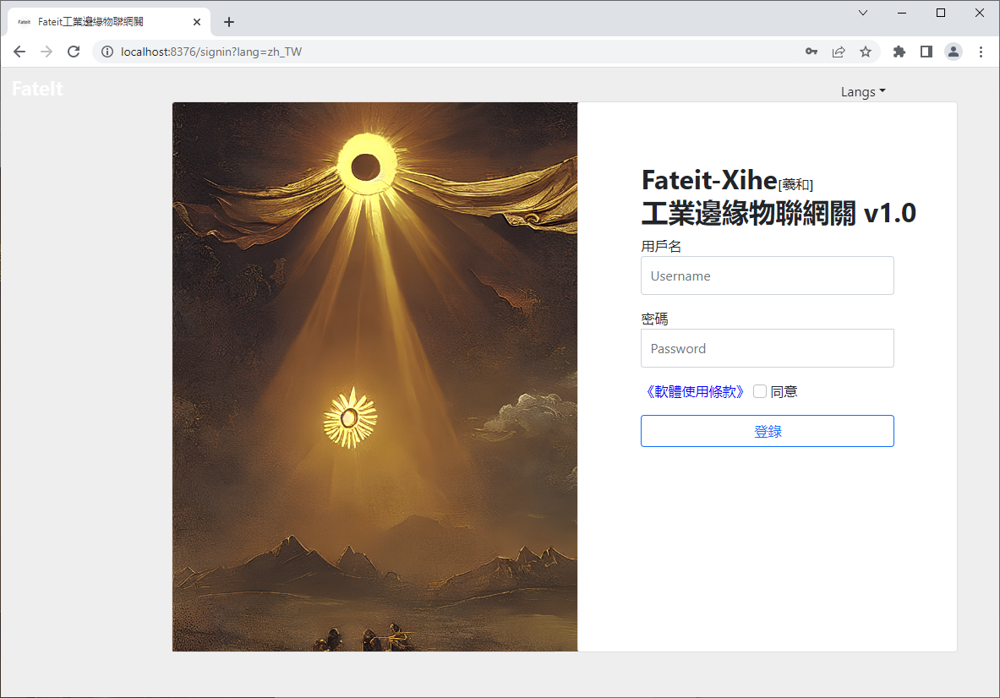

# xihe-iot-gateway
Industrial IoT Gateway

[中文简体](#中文简体) [中文繁體](#中文繁體) [English](#English)

>### 中文简体

<h1><b>Fateit-Xihe 工业物联网关</b></h1>
 

&nbsp;&nbsp;&nbsp;&nbsp;Fateit-Xihe 是一款免费的工业物联网网关，简称羲和物联网关，可跨平台运行，功能丰富，运行稳定可靠且易于使用，支持不同种类的设备（PLC、半导体、物联网设备），通过MQTT推送变化的数据，且提供基于http的轻量级数据读写接口。 
&nbsp;&nbsp;&nbsp;&nbsp;降低设备互联门槛，打通<b>设备交互</b>、<b>数据采集</b>、<b>数据落地</b>的难点，从而助力中小微企业实现数字化、智能化升级的转型。 
为企业提升生产、质量效益，从而提高企业整体的竞争力。 
<b>主要功能：</b> 
1、内置MQTT v3 Broker：原生<b>高性能</b>Mqtt服务端，支持:tcp(1883)、websocket(8083)，无需部署另外的MQTT Broker。 
2、支持的驱动：<b>Modbus(tcp)</b>、<b>半导体协议:SECS/GEM(hsms)</b>、<b>OPC UA</b>、<b>Iot Message(mqtt)</b>，后续会按计划扩展。 
3、数据基于事件变化推送到MQTT。 
4、断线重连、设备启动自动连接。 
5、独特内存<b>数据结构</b>设计，对于多点位读取性能更强。 
6、<b>一键启动</b>，简易在线配置拆箱即用，低运维成本，拒绝繁琐配置。 
7、<b>支持消息Cassandra、Kafka推送，方便进行大数据存储、传输以及分析[开启会增加额外的资源开销]</b> 
8、<b>Fateit 富有生命力的数字化生态圈支持</b> 
9、适合运行在<b>边缘端</b>、也适合运行在<b>服务器</b>上，满足用户各种实际场景。 
&nbsp;&nbsp;&nbsp;&nbsp;隐藏设备协议对接的复杂性，助力设备对接的快速落地，提供简化、统一化、通用化、超前化的数据对接方式与数据结构，让用户更专注于上层架构，聚焦自身核心业务，为企业的发展提速。   

>### 中文繁體

<h1><b>Fateit-Xihe 工業物聯網關</b></h1>
 

&nbsp;&nbsp;&nbsp;&nbsp;Fateit-Xihe 是一款免費的工業物聯網網關，簡稱羲和物聯網關，可跨平臺運行，功能豐富，運行穩定可靠且易於使用，支持不同種類的設備（PLC、半導體、物聯網設備），通過MQTT推送變化的數據，且提供基於http的羽量級數據讀寫接口。 
&nbsp;&nbsp;&nbsp;&nbsp;降低設備互聯門檻，打通<b>設備交互</b>、<b>數據採集</b>、<b>數據落地</b>的難點，從而助力中小微企業實現數位化、智能化升級的轉型。 
為企業提升生產、品質效益，從而提高企業整體的競爭力。 
<b>主要功能：</b> 
1、內置MQTT v3 Broker：原生<b>高性能</b>Mqtt服務端，支持:tcp(1883)、websocket(8083)，無需部署另外的MQTT Broker。 
2、支持的驅動：<b>Modbus(tcp)</b>、<b>半導體協議:SECS/GEM(hsms)</b>、<b>OPC UA</b>、<b>Iot Message(mqtt)</b>，後續會按計畫擴展。 
3、數據基於事件變化推送到MQTT。 
4、斷線重連、設備啟動自動連接。 
5、獨特記憶體<b>數據結構</b>設計，對於多點位讀取性能更強。 
6、<b>一鍵啟動</b>，簡易線上配置拆箱即用，低運維成本，拒絕繁瑣配置。 
7、<b>支持消息Cassandra、Kafka推送，方便進行大數據存儲、傳輸以及分析[開啟會增加額外的資源開銷]</b> 
8、<b>Fateit 富有生命力的數位化生態圈支持</b> 
9、適合運行在<b>邊緣端</b>、也適合運行在<b>伺服器</b>上，滿足用戶各種實際場景。 
&nbsp;&nbsp;&nbsp;&nbsp;隱藏設備協議對接的複雜性，助力設備對接的快速落地，提供簡化、統一化、通用化、超前化的數據對接方式與數據結構，讓用戶更專注於上層架構，聚焦自身核心業務，為企業的發展提速。   

>### English

<h1><b>Fateit-Xihe Industrial IoT gateway</b></h1>
 

&nbsp;&nbsp;&nbsp;&nbsp;Fateit-Xihe is a free industrial IoT gateway that can run across platforms, with rich functions, stable and reliable operation and easy to use. It supports different types of devices (PLC, semiconductor,iot devices), pushes changing data through MQTT, and provides http-based lightweight data read and write interface. 
&nbsp;&nbsp;&nbsp;&nbsp;Lower the threshold of equipment interconnection, get through the difficulties of <b> equipment interaction </b>, <b> data collection </b>, <b> data landing </b>, so as to help small, medium and micro enterprises to realize the transformation of digital and intelligent upgrading.  For the enterprise to improve the production, quality and efficiency, so as to improve the overall competitiveness of the enterprise. \
<b>Main functions:</b> 
1. Built-in MQTT v3 Broker: native <b>high-performance</b> Mqtt server, supports: tcp(1883), websocket(8083), no need to deploy another MQTT Broker.  
2. Supported drivers: <b>Modbus(tcp)</b>, <b>Semiconductor protocol: SECS/GEM(hsms)</b>, <b>OPC UA</b>, <b>Iot Message (mqtt)</b>, and will be expanded as planned in the future.  
3. Data is pushed to MQTT based on event changes.  
4. After disconnection and reconnection, the device starts to connect automatically.  
5. Unique memory <b>data structure</b> design, with stronger multi-point reading performance.  
6. <b>One-click startup</b>, simple online configuration, ready to use out of the box, low operation and maintenance costs, and no need for cumbersome configuration.  
7. <b>Support message Cassandra, Kafka push, convenient for big data storage, transmission and analysis [Enabling will increase additional resource overhead]</b> 
8. <b>Fateit is supported by a vibrant digital ecosystem</b> 
9. suitable for running in the <b>edge end</b>, but also suitable for running in <b>the server</b>, to meet the user of a variety of actual scenarios. 
&nbsp;&nbsp;&nbsp;&nbsp;Hide the complexity of device protocol docking, facilitate the rapid implementation of device docking, provide simplified, unified, generalized, and advanced data docking methods and data structures, allowing users to focus more on the upper-layer architecture, Focus on its own core business and accelerate the development of the enterprise.    
